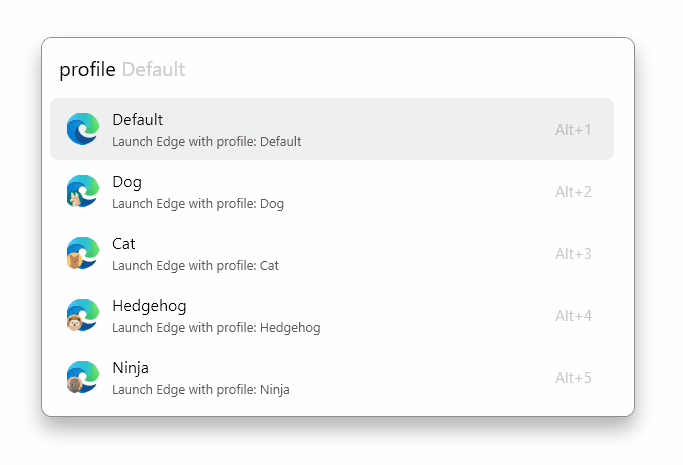

:toc: macro
:toclevels: 3
:icons: font
:source-highlighter: rouge

++++

    
    
    

++++

= Microsoft Edge Profile Switcher for FlowLauncher

A https://www.flowlauncher.com/[FlowLauncher] plugin to easily launch different MS Edge Profiles.

toc::[]
:toclevels: 3

== Installation

=== Prerequisites

* https://www.flowlauncher.com/[FlowLauncher] installed on Windows
* Microsoft Edge

=== Install via FlowLauncher

. Open FlowLauncher
. Type `pm install Edge Profiles`
. Press Enter to install the plugin
. Restart FlowLauncher if prompted

=== Manual Installation

. Download the latest release from the https://github.com/TillKnollmann/Flow.Launcher.Plugin.EdgeProfiles/releases[GitHub Releases page]
. Extract the ZIP file to your FlowLauncher plugins directory:
+
[source]
----
%APPDATA%\FlowLauncher\Plugins\Byte Stash-{version}
----
. Restart FlowLauncher

== Usage

Type `profile <search-term>` and see a list of profiles available from your Microsoft Edge installation.
Select a result to launch a new window in the respective profile.

[.center.text-center]

== Attributions

This plugin makes use of the following resources:

* *https://en.m.wikipedia.org/wiki/File:Microsoft_Edge_logo_%282019%29.png[Microsoft Edge image on Wikipedia]*: Icons used in the plugin interface

== Support

For issues, feature requests, or questions, open an issue on https://github.com/TillKnollmann/Flow.Launcher.Plugin.EdgeProfiles/issues[GitHub Issues].

== License

This project is licensed under the GNU General Public License v3.0 (GPL-3.0).

For more information about the GPL-3.0 license, visit: https://www.gnu.org/licenses/gpl-3.0.html

== Links

* *FlowLauncher*: https://www.flowlauncher.com/
* *Microsoft Edge*: https://www.microsoft.com/edge

---

Made with ❤️ for the FlowLauncher community
